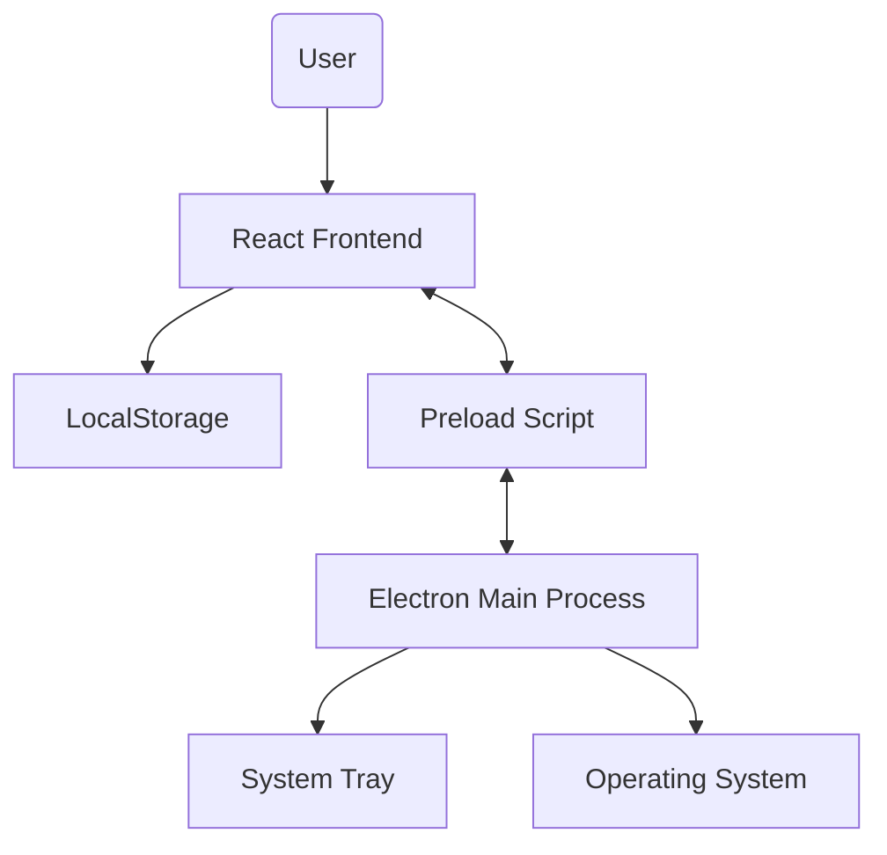
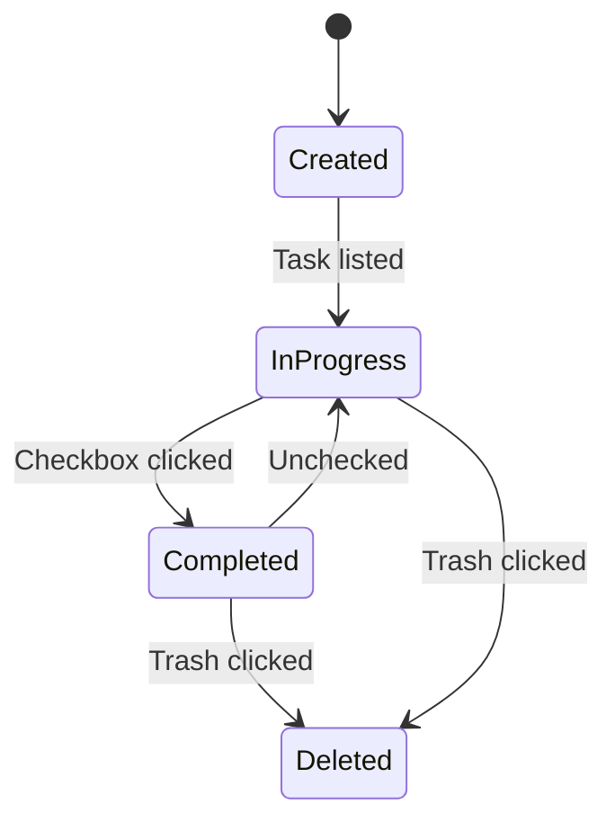

# NIYATI – Your Destiny Dashboard

NIYATI is a calm, minimal, and elegant desktop goal-tracking widget designed to help you stay focused on your destiny without the noise of the cloud. It lives on your desktop as a beautiful, resizable, glassmorphic window.

## ✨ Philosophy
- **Calm & Minimal**: No bloat, no distractions.
- **Fully Local**: Your data stays on your machine. No cloud, no telemetry.
- **Elegant**: A premium glassmorphism aesthetic that complements any wallpaper.
- **Flexible**: Use it as a sidebar, a small widget, or a full dashboard.

## 🚀 Features
- **Frameless Widget**: Resizable window with custom drag areas.
- **Always-on-Top**: Keep your goals in sight while you work.
- **Glassmorphism UI**: Beautiful transparent effects with blur control.
- **Custom Backgrounds**: Choose from solid colors, gradients, nature/animal presets, or upload your own icon/wallpaper.
- **Goal Management**: Track Daily, Weekly, Monthly, and Long Term goals.
- **Offline Storage**: Uses browser `localStorage` for high-speed offline data persistence.
- **System Tray**: Minimize to tray to keep your workspace clean.

## 🛠️ Tech Stack
- **Electron**: Desktop environment.
- **React**: UI framework.
- **Vite**: Rapid development and building.
- **Tailwind CSS V4**: Modern utility-first styling.
- **Lucide React**: Clean and consistent iconography.

## 🏗️ High-Level Architecture


## 🔄 Goal State Flow


## 📂 Project Structure
```text
niyati/
├── main.js              # Electron Main Process (Window & Tray)
├── preload.js           # Secure IPC bridge
├── package.json         # Scripts and dependencies
├── vite.config.js       # Vite build configuration
├── /src
│   ├── App.jsx          # Main Dashboard logic & layout
│   ├── main.jsx         # React entry point
│   ├── index.css        # Tailwind & Global styles
│   ├── components/      # UI components (GoalItem, WindowControls)
│   ├── hooks/           # Custom hooks (useGoals, useSettings)
│   └── utils/           # Helper functions
```

## 🛠️ Development & Build

### 1. Installation
```bash
# Clone the repository (if applicable)
# Navigate to the project folder
npm install
```

### 2. Run in Development Mode
```bash
npm run electron:dev
```

### 3. Create Production Build
```bash
npm run build
```

### 4. Package as Portable Windows App
```bash
npm run package
```
*The packaged app will be available in the `dist-electron` folder.*

## 🎨 Customization
- **Blur Intensity**: Adjust how much the background blurs through settings.
- **Custom Wallpapers**: Use the upload button in settings to set any image as your dashboard background.
- **Category Tabs**: Switch between Daily, Weekly, Monthly, and Long-Term goals easily.

## 🛣️ Future Upgrade Ideas
- [ ] Export/Import data (JSON).
- [ ] Multiple theme presets (Dark/Light/Sunset).
- [ ] Pomodoro timer integration.
- [ ] Achievement badges for completed goals.

## 📜 License
Internal / Private - NIYATI – Your Destiny Dashboard.

## ✍️ Author
Designed & Developed by Mayank.
